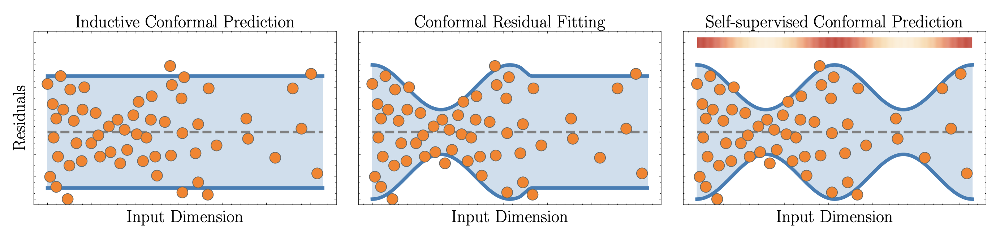
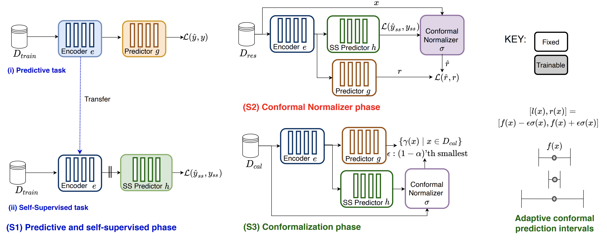

# SSCP:  Improving Adaptive Conformal Prediction Using Self-supervised Learning

[](TBD)
[](https://github.com/seedatnabeel/SSCP/blob/main/LICENSE)



This repository contains the implementation of SSCP, from the paper "Improving Adaptive Conformal Prediction Using Self-supervised Learning"

SSCP illustrates the utility of using the signal from self-supervision to improve the adaptiveness of conformal prediction.

For more details, please read our [AISTATS 2023 paper](Link coming soon): *Improving Adaptive Conformal Prediction Using Self-supervised Learning*.

## Installation
1. Clone the repository
2. Create a new virtual environment with Python 3.8. e.g:
```shell
    virtualenv sscp_env
```
3. With the venv activated, run the following command from the repository directory:

- Install the minimum requirements to run SSCP
 ```shell
pip install -r requirements.txt
 ```

4. Link the venv to the kernel:
  ```shell
 python -m ipykernel install --user --name=sscp_env
 ```

## Logging
Outputs from scripts can be logged to [Weights and Biases - wandb](https://wandb.ai). An account is required and your WANDB_API_KEY and Entity need to be set in wandb.yaml file provided.


## Getting started with SSCP



To get started with SSCP one can make use of the scripts which run the main Conformalized Residual Fitting (CRF) and Conformalized Quantile Regression (CQR) experiments or the notebooks which have the synthetic and later insights experiments

### Scripts
To run the CFR and CQR experiments for both labeled and unlabeled one can run the bash scripts found in the scripts folder. For example:
```shell
 bash labeled_cfr.sh
 ```

### Notebooks
To run the synthetic experiments and the insights experiments one can run any of the Jupyter notebooks (.ipynb) found in the ``src`` folder


## Citing

If you use this code, please cite the associated paper:

```
@inproceedings{seedat2023sscp,
  title={Improving Adaptive Conformal Prediction Using Self-supervised Learning},
  author={Seedat, Nabeel and Jeffares, Alan and Imrie, Fergus and van der Schaar, Mihaela},
  booktitle={International Conference on Artificial Intelligence and Statistics},
  year={2023},
  organization={PMLR}
}

```
